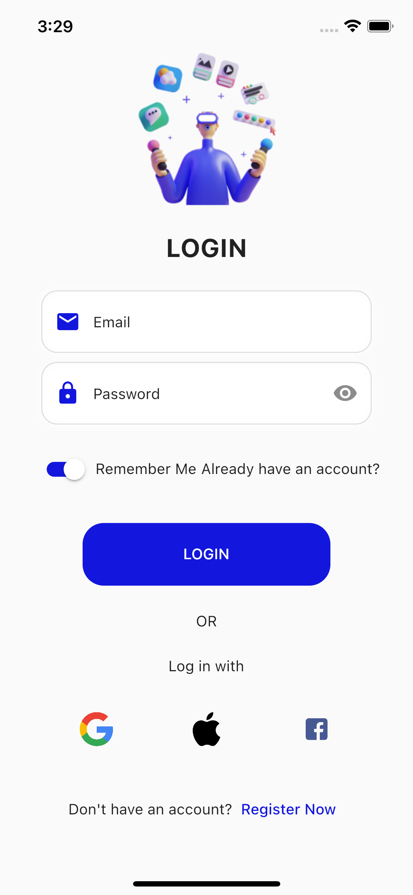
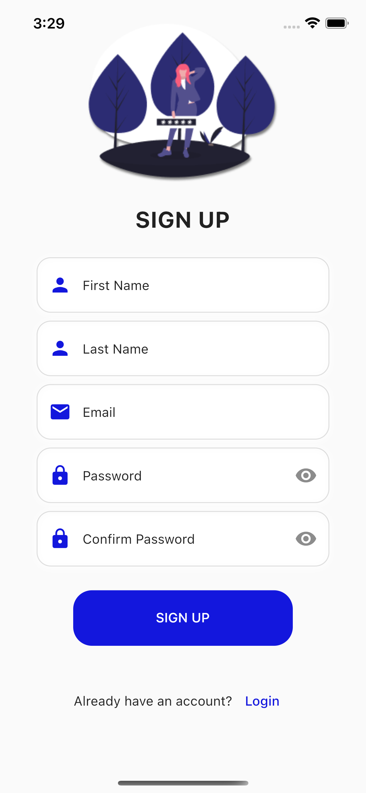

# Flutter Login and Register UI with Atomic Widgets

In this project, login and register UI was created using atomic widgets along with clean code.You can access the application's atomic widgets under the product/widget folder.
In addition, the Kartal package was used to create a responsive design in the project.

## Project Run

Clone this Project

  ```bash
  git clone https://github.com/gamzegurcan/Flutter-Login-Register-UI.git
  
  ```
  


Go to base
 ```bash

  cd my-project

 ```
 
Get Project Packages
```bash
  flutter pub get

```
Project Run
```bash
  flutter run
```
## Project ScreenShots

<table>
  <tr>
    <td>Login Page</td>
    <td>Register Page</td>
  </tr>

  <tr>
    <td></td>
    <td></td>
  </tr>  

</table>
